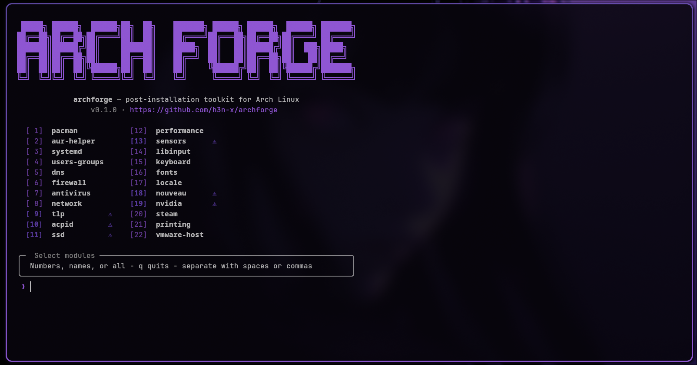

<h3 align="center">
  
  archforge
  
  <br/>
  <a href="https://github.com/h3n-x/archforge">Modular post-installation toolkit for Arch Linux</a>
  <br/><br/>
  <p>
    🌐 <strong>English</strong> · <a href="README.es.md">Español</a>
  </p>
</h3>

<p align="center">
  <a href="https://github.com/h3n-x/archforge/stargazers"></a>
  <a href="https://github.com/h3n-x/archforge/issues"></a>
  <a href="https://github.com/h3n-x/archforge/graphs/contributors"></a>
</p>

<p align="center">
  
  
  
  
</p>

<p align="center">
  <a href="docs/en/modules.md">Module reference</a>
  ·
  <a href="CONTRIBUTING.md">Contributing</a>
  ·
  <a href="https://github.com/h3n-x/archforge/blob/main/LICENSE">License</a>
</p>

&nbsp;

## 🪄 About

`archforge` automates the configuration of a freshly installed **Arch Linux** system. It runs independent **modules** that configure packages, services, security, networking, performance, input, console, graphics, and more. Every change is automatically **backed up** and can be reverted with `archforge restore`.

> [!NOTE]
> **ArchWiki only (official):** README text, module descriptions, links, and implementation guidance in this repository are based **solely** on the public [ArchWiki](https://wiki.archlinux.org/) — the official Arch Linux wiki. Where user repositories are involved, that means the same wiki (e.g. [Arch User Repository](https://wiki.archlinux.org/title/Arch_User_Repository), [AUR helpers](https://wiki.archlinux.org/title/AUR_helpers)), not third-party blogs or unofficial guides. The wiki remains the authoritative, up-to-date source; `archforge` is a helper and may lag behind wiki edits.

&nbsp;

## 🚀 Quick start

```bash
git clone https://github.com/h3n-x/archforge.git
cd archforge
chmod +x archforge
./archforge
```

> [!TIP]
> Use `./archforge --dry-run` first to see what would change without applying anything.

&nbsp;

## 🖥️ Interactive menu

> [!NOTE]
> Without `--modules`, a **two-column numbered menu** appears. Choose by **number** (`1 3 5`), by **module id** (`pacman firewall`), the word **`all`** for every module, or **`q`** to quit. Separate tokens with **spaces or commas**. Rows may show **⚠** when a module can touch hardware or deserves a quick review before applying.

&nbsp;

## 📦 Install (system-wide)

```bash
sudo make install
```

This installs the `archforge` script and copies `lib/` and `modules/` under `$(PREFIX)/share/archforge` (default prefix: `/usr/local`). See the `Makefile` for `DESTDIR` and `PREFIX`.

&nbsp;

## 🎨 Preview

<p align="center">
  
  <br/><br/>
  <sub><i>Interactive TUI: run <code>./archforge</code> in a UTF-8 terminal for the live experience.</i></sub>
</p>

&nbsp;

## 📋 Available modules

| ID | Name | Category | Description |
|---|---|---|---|
| `pacman` | Package Management: pacman | Package Management | [Configure pacman.conf, multilib, reflector, keyring, pkgfile, paccache](https://wiki.archlinux.org/title/Pacman) |
| `aur-helper` | Package Management: AUR helper | Package Management | [Detect/install AUR helper (yay/paru), makepkg optimization](https://wiki.archlinux.org/title/AUR_helpers) |
| `systemd` | System Services: systemd | System Services | [Persistent journal drop-in, boot analysis, timesyncd](https://wiki.archlinux.org/title/Systemd) |
| `users-groups` | System: Users and Groups | System Services | [User accounts, groups, sudo config](https://wiki.archlinux.org/title/Users_and_groups) |
| `dns` | Security: DNS configuration | Security | [DNS provider detection, 6 providers, DNSSEC, DoT](https://wiki.archlinux.org/title/Domain_name_resolution) |
| `firewall` | Security: Firewall (nftables) | Security | [nftables profiles (desktop/server/strict), SSH rate limiting, drop logging](https://wiki.archlinux.org/title/Nftables) |
| `antivirus` | Security: Antivirus (ClamAV) | Security | [ClamAV with clamd config, freshclam, optional on-access scanning + scan timer](https://wiki.archlinux.org/title/ClamAV) |
| `network` | Networking: network configuration | Networking | [Hostname, /etc/hosts, NetworkManager, WiFi powersave, regulatory domain, MAC randomization](https://wiki.archlinux.org/title/NetworkManager) |
| `tlp` | Power: TLP | Power Management | [Battery optimization, charge thresholds, USB denylist](https://wiki.archlinux.org/title/TLP) |
| `acpid` | Power: ACPI events (acpid) | Power Management | [Lid close suspend, power button events](https://wiki.archlinux.org/title/Acpid) |
| `ssd` | Optimization: SSD | Optimization | [TRIM verify, fstrim timer, continuous discard, noatime, tmpfs /tmp](https://wiki.archlinux.org/title/Solid_state_drive) |
| `performance` | Optimization: Performance | Optimization | [Network sysctls, THP, zram, OOM killer, CPU governor](https://wiki.archlinux.org/title/Improving_performance) |
| `sensors` | Optimization: Hardware sensors | Optimization | [lm_sensors, sensor detection](https://wiki.archlinux.org/title/Lm_sensors) |
| `libinput` | Input: libinput (touchpad/mouse) | Input | [Touchpad, natural scroll, TrackPoint, Wayland note](https://wiki.archlinux.org/title/Libinput) |
| `keyboard` | Input: Keyboard layout | Input | [Console keymap, X11 layout via localectl](https://wiki.archlinux.org/title/Keyboard_configuration_in_console) |
| `fonts` | Console: Fonts | Console | [terminus-font, noto-fonts, ttf-liberation, vconsole.conf](https://wiki.archlinux.org/title/Fonts) |
| `locale` | Console: Locale & timezone | Console | [locale-gen, timezone, hardware clock sync, NTP](https://wiki.archlinux.org/title/Locale) |
| `nouveau` | Graphics: Nouveau (open-source NVIDIA) | Graphics | [Open-source NVIDIA driver](https://wiki.archlinux.org/title/Nouveau) |
| `nvidia` | Graphics: NVIDIA driver | Graphics | [Proprietary NVIDIA driver install](https://wiki.archlinux.org/title/NVIDIA) |
| `steam` | Gaming: Steam | Gaming | [Steam, Proton/Wine deps, fd-limit, GameMode, MangoHud](https://wiki.archlinux.org/title/Steam) |
| `printing` | Peripherals: Printing (CUPS) | Peripherals | [CUPS, printer drivers, avahi](https://wiki.archlinux.org/title/CUPS) |
| `vmware-host` | Virtualization: VMware Workstation (host) | Virtualization | [VMware Workstation host setup](https://wiki.archlinux.org/title/VMware) |

&nbsp;

## ⚙️ CLI flags

```
--modules m1,m2,...    Run specific modules (skips menu)
--dry-run              Show what would change, execute nothing
--yes, -y              Skip all confirmation prompts
--aur-helper=NAME      Override AUR helper (yay, paru, ...)
--help, -h             Show help
--version              Show version
```

&nbsp;

## 🔄 Restore

```bash
./archforge restore
```

Shows previous sessions and lets you selectively restore backed-up files.

&nbsp;

## 🛠️ Development

```bash
make lint    # shellcheck
make test    # bats
make check   # lint + test
```

&nbsp;

## 📎 Requirements

- **Arch Linux** (or compatible derivative)
- **bash** >= 5.0
- **sudo** privileges

&nbsp;

## 📚 Documentation

| Resource | Description |
|---|---|
| [docs/en/modules.md](docs/en/modules.md) | Module list with packages and wiki links (English) |
| [docs/es/modules.md](docs/es/modules.md) | Same, Spanish |
| [README.es.md](README.es.md) | This readme in Spanish |

&nbsp;

## 🤝 Contributing

Contributions are welcome. See [CONTRIBUTING.md](CONTRIBUTING.md) for tests, `shellcheck`, and the module API (`module_info` / `module_run`).

&nbsp;

## 🙋 FAQ

- **Q: _How do I skip the menu?_** \
  **A:** Pass explicit module ids: `./archforge --modules pacman,firewall` (comma-separated). To run everything without typing each id, use the interactive menu and enter **`all`**.

- **Q: _Where are backups stored?_** \
  **A:** By default under `~/.local/share/archforge/backups/<session-id>/`. Override with the `BACKUP_BASE_DIR` environment variable. Use `./archforge restore` to pick a previous session interactively.

&nbsp;

## 💝 Thanks

- [Arch Linux](https://archlinux.org/) and the [ArchWiki](https://wiki.archlinux.org/) authors
- README layout inspired by the [Catppuccin](https://github.com/catppuccin/catppuccin) community’s port templates (badges, spacing, sections). **Not affiliated** — only structural inspiration.

&nbsp;

<p align="center">
  
</p>

<p align="center">
  Copyright © 2026 <a href="https://github.com/h3n-x">h3n-x</a>
</p>

<p align="center">
  <a href="https://github.com/h3n-x/archforge/blob/main/LICENSE"></a>
</p>
